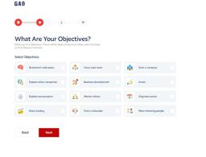

# Code along learning projects.

|  #  | Project  | Demo          |Thumbnail|
| :-: | -------- | ------------- |---------|
|00| [gulp-starter](https://github.com/xml12333/HTML_SCSS_JS/tree/main/00.gulp-starter)| | |
|01| [TechCompany_Mozi_Website](https://github.com/xml12333/HTML_SCSS_JS/tree/main/01.TechCompany_Mozi_Website)| [Demo](https://nikt.com.ua/projects/htmlScssJs/01.TechCompany_Mozi_Website/)| |
|02| [Parcel_Landing](https://github.com/xml12333/HTML_SCSS_JS/tree/main/02.Parcel_Landing)| [Demo](https://nikt.com.ua/projects/htmlScssJs/02.Parcel_Landing/)| |
|03| [Snikpic_Landing](https://github.com/xml12333/HTML_SCSS_JS/tree/main/03.Snikpic_Landing)| [Demo](https://nikt.com.ua/projects/htmlScssJs/03.Snikpic_Landing/)| |
|04| [Form_Slide](https://github.com/xml12333/HTML_SCSS_JS/tree/main/04.Form_Slide)| [Demo](https://nikt.com.ua/projects/htmlScssJs/04.Form_Slide/)| |
|05| [Gambling_Landing](https://github.com/xml12333/HTML_SCSS_JS/tree/main/05.Gambling_Landing)| [Demo](https://nikt.com.ua/projects/htmlScssJs/05.Gambling_Landing/)| |
|06| [InvestCapital_Landing](https://github.com/xml12333/HTML_SCSS_JS/tree/main/06.InvestCapital_Landing)| [Demo](https://nikt.com.ua/projects/htmlScssJs/06.InvestCapital_Landing/)| |
